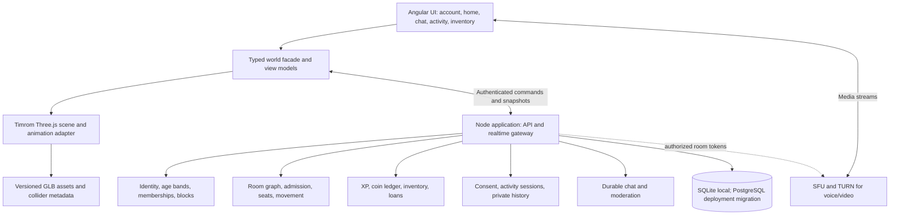

# Timrom × One World: product and implementation review

> **Integration update:** all R01–R24 recommendations are accepted and implementation has begun. The repository now contains a connected Angular UI and local backend; `/?preview=1` retains the separate visual demo. See [current integration status](INTEGRATION-STATUS.md) for completed behavior and remaining work. Earlier sections below describe the pre-integration baseline and are historical where superseded.

Reviewed 30 September 2026. This is a comparison of observed code, the supplied architecture document and previously agreed requirements. A proposal in the friend's document is not treated as approval to replace a user decision. The founder has confirmed D1–D4: the existing XP/interactive-coin policy, free movement around the current home with joined homes shown as neighbours, social features before lifestyle backends, and community homes with optional template-based creation. Other choices remain pending.

## Recommendation

Continue with **Timrom's visual world in Angular**, and adapt the working One World backend domains to it. Preserve social interaction as the main purpose, with study, work, gaming and everyday routines as contexts. Timrom gives us a substantially richer visual foundation; One World gives us a tested starting point for real accounts, shared rooms, permissions, ownership and economy. Neither is a finished public product, and connecting them is a separate implementation phase.

The useful combined experience is a cozy, connected home where real people meet, talk and do activities, with optional routine tracking and earned customization. The two apps currently optimize different loops: Timrom is primarily **timer → coins → decorate**; One World is **find/join a home → interact in a room → earn progression**.

## Evidence and limits

- Friend's repository: `https://github.com/rishabhch18/timrom`, reviewed at commit `87c5163aebbd6113e20b00fe1a8c54bee6bcfa58`, “Timrom web prototype, 3D models, feature guide.” The original `timrom.html`, `models.json`, `models/`, screenshots and illustrated guide are retained.
- Supplied document: **Timrom — Product & Backend Architecture**, dated 29 September 2026. Its text, tables and architecture diagram were reviewed. The diagram describes a proposed backend; it is not evidence that those services exist.
- Current app: sibling `../one-world/`, especially `server/{accounts,engine,connected,index}.mjs`, `src/{App,ConnectedScene}.jsx`, `src/useCall.js` and its tests. Its 30 automated tests were rerun and passed.
- Existing decisions: `../product-discovery.md`, `../economy-specification.md`, `../implementation-v0.2.md`, `../visual-review/decisions.md` and `../visual-review/motion-requirements.md`.
- The Angular migration is in this repository on local branch `codex/angular-migration`. It has not been pushed. See [migration scope](ANGULAR-MIGRATION.md) for exactly what was converted.
- This is a code/product review with selected browser walkthroughs, not a penetration test, legal clearance, complete accessibility audit or load certification. Competitive superiority/download claims in the supplied document were not independently verified and are not adopted here.

## Feature-by-feature comparison

“Local backend” means working on this machine, not production ready. “Proposed” means in the document, not implemented in the friend's repository.

| Area | Our One World app | Friend's Timrom code/document | Combined requirement or gap |
|---|---|---|---|
| Product focus | Social homes and real interaction, routines alongside | Whole-day timers, decorating and friend neighbourhood | Keep social-first positioning unless explicitly changed; daily goals must not dominate chat/calls |
| Framework | React 19, Vite, Three.js 0.180 | One HTML file, Three.js 0.147, GSAP, Web Audio | Angular migration now runs; retain original rendering version initially for visual parity |
| Graphics | Procedural soft avatars/furniture, limited color options | 51 GLB assets, detailed house, outdoor world, animated characters/pets, finishes and music | Adopt Timrom visuals; approval of style does not certify every motion |
| Account creation | Email/password or mobile OTP flows; local test-code delivery | No account UI/backend; document proposes email/password and OAuth | Preserve either verified contact, optional second contact, unique @username and separate display name; add actual delivery/recovery |
| Contact privacy | Server omits contacts from other users' snapshots | No real contact records; document schema lists email | Keep phone/email private; add profile search by username/display name with identity disambiguation |
| Ages | Self-declared 13–17 and 18+ bands, server-separated homes/friends | Initial audience 16–30; safety section says 13+, teen friend-only DMs | 13+ and separate teen/adult spaces remain required; document's narrower marketing audience is not an age rule |
| Home model | Member-based community homes, invite-only creation, host controls | One personal house per user plus sample neighbour houses | **Resolved D4:** community homes first; no automatically provisioned personal house. Users may explicitly create their own home from templates; memberships and owner/admin controls remain required |
| Public discovery | Illustrative geographic discovery with region/genre filters | Sample neighbourhood list and shared outdoor park; no geographic globe | **Resolved D2:** free movement around the current home and its surroundings; other joined homes appear as neighbours for easy navigation. Globe/invites remain the discovery/join requirement; a separate public park network is not newly approved |
| Connected rooms | Server routes through doors across discrete rooms | Continuous visual house with client A* and furniture collision grid | Timrom's visual regions need room IDs, boundaries, permitted doorways and shared authoritative paths |
| Room admission | Positive capacity, 0 unlimited logical occupancy; crossing rechecked | No real occupancy, room capacities or admission gates | Add capacity slider with explicit Unlimited at 0; positive limits, locks and age restrictions enforced at crossing |
| World movement | Server-driven grid path and occupancy rules | Client pathfinding/steering in house and outdoors | Reconcile coordinate systems, collider metadata, door traversal and server correction; do not trust incoming positions |
| Camera | Follow avatar / whole-home view | Orbit, zoom, recenter, mode transitions; outdoor follow behavior | Preserve angled overhead follow/overview requirement inside homes too |
| Furniture actions | Explicit action menu and reservation; fixed in ordinary use | Object menu chooses activity/duration; canned GLB/procedural poses | Keep menu before action, approach/contact alignment and exclusive usable slots |
| Tracking consent | Room opt-in and separate furniture opt-in; manual activity precedence | Choosing an object starts a timer; no equivalent independent consent settings | Room/furniture actions must stay visual when tracking is off; do not auto-infer real behavior as verified fact |
| Activity visibility | Private history, controlled current activity publication | Document shares live activity on public home snapshot unless hidden; sample statuses visible | Private by default and explicit publication controls remain required; bathroom/sleep detail needs careful presentation |
| Text chat | Persistent server room messages, spam/replay checks | General channel through optional hosting API; local fallback; canned neighbour DMs | Local Angular preview is explicitly offline. Add real room channels and later real DMs; keep text chat visible beside world on desktop |
| Friends | Requests by username/avatar, same-band access, block/report | Neighbours are examples; adding friend creates local sample; document proposes graph | Replace sample identities/statuses/replies with authenticated users; preserve relationship and block checks |
| Focus together | Shared activities can qualify for rewards | Local timer labelled with sample friend's name | Need actual invitations, acceptance, independent consent/timers and cancellation behavior |
| Voice/video | Local WebRTC mesh and scoped signaling, 6-call limit; live capture not fully verified | Not built; document suggests provider later | Real room voice/video is core user scope, not silently deferred; SFU/TURN and multi-device tests remain required |
| Voice-follow | Explicit first join, separate follow opt-in, preserves mic/camera state | No implementation | Ask once and persist auto-join consent; later room entry joins automatically even without an active prior call. Preserve mic/camera state and provide a disable control |
| Online XP | 1 XP/connected minute trial rule, once/account across tabs; all passive activities count | No user XP levels; pet XP is logged minutes | Keep account XP separate from pet growth and coins; all logged-in time rule requires a clear connection/disconnection policy |
| Coin earning | Interactive participation per time window, not per message; passive rest alone earns none | Every completed activity minute pays, plus streak, Great Day and task bonuses | **Resolved D1:** retain online XP and interactive coins. Angular removes timer/task/Great Day payouts; real earning awaits backend integration |
| Unlocks | Account level requirements, then coin purchase | Furniture ownership flags; pet unlocks by session count | XP levels unlock access; coins buy items. Resolve any additional pet/session conditions explicitly |
| Paid coins | Approved product requirement, no payment implementation | Not implemented; document leaves monetization open | Add earned/purchased provenance, verified payment webhooks, idempotency, refunds and teen purchase policy before selling |
| Furniture copies | Personal instance per furniture purchase; reusable themes/finishes | One boolean owned/placed per catalog type | Replace booleans with item-instance IDs and quantities; preserve reusable theme/color/texture entitlements |
| Lending/donation | Both implemented; loans reclaimable, donations permanent | Neither code nor proposed inventory model handles these | Retain both; home removal/ban and occupied-item return need consistent rules |
| Home building | Add rooms, fixed grid; item placement with route validation | Beautiful fixed floorplan; purchases place decor at predefined spots | Neither is a complete custom house editor. Need room/door editing, furniture transforms, collision/approach validation and edit permissions |
| Pets | None | Local roam/growth/adoption; proposed backend tables | **Resolved D3:** pet backend follows social homes/chat/calls. Pet limits and growth rules remain open; preview artwork can be retained |
| Household | Actual members are user accounts | Editable local NPC people/relations | **Resolved D3:** NPC household backend follows social homes/chat/calls. Separate these characters from real home members |
| Personal features | Activity history, no rich lifestyle suite | Mailbox tasks, memory journal, daily goal, weekly chart, Great Day/streaks | **Resolved D3:** task/journal backends follow social homes/chat/calls; tasks/memories stay private. Daily-goal/dashboard scope remains separate; no coin bonuses approved |
| Music | None | Six generated Web Audio tracks, previews, local unlocks | **Resolved D3:** music backend follows social homes/chat/calls; retain preview controls. Music is distinct from room voice and media streaming |
| Games | External links supported; embedded mini-games later | No equivalent game integration seen | Preserve external-game-first decision; define links/launch behavior and later game sessions |
| Language/mobile | Partial English/Hindi, responsive web | English copy, responsive single page; no native app | Full bilingual copy, touch/accessibility and mobile performance remain work; native mobile later |
| Moderation | Local block/report, owner bans; reports stored without full admin queue | Document proposes filtering/report/admin services; code has no equivalent trusted enforcement | Moderation operations, staff tools, contact restrictions and appeals are missing for launch |
| Persistence | SQLite backend, authoritative economy/admission, in-memory presence | localStorage; optional hosting service chat/presence only | Preserve server authority; never import demo balances or simulated users into real accounts |
| Infrastructure | One Node process, HTTP + WebSocket, full snapshots | Proposed REST + gateway, Postgres + Redis + object storage/CDN | Start with modular Node backend and measured limits; split infrastructure when needed, not just to copy the diagram |
| Testing | 30 domain/HTTP/WebSocket tests pass | No equivalent test suite in upstream | Carry domain tests forward; add Angular integration, multi-user scene, media, accessibility and load tests |

## Important differences between the document and runnable code

1. **A shared host is a dependency, not a backend included in the repo.** `initNet()` looks for `window.claude.use('db'/'room'/'user')`. A normal local server has none of those services. The Angular build deliberately uses an explicit local preview; no host credentials or broadcasts are inferred.
2. **Timers and money are client-owned today.** `tickSession()`, `finishSession()` and `greatDay()` change browser state. The document's server clocks, ledgers, 24-hour bounds, atomic bonuses and idempotency are proposed safeguards, not current guarantees. The default 60× demo clock and 420 sample coins must never reach a real wallet.
3. **Neighbours, statuses, DMs and focus labels are sample behavior.** `freshState()`, `replyFor()` and `sendDM()` generate/simulate them. Some historical dashboard values are seeded examples too.
4. **A furniture purchase is not a free placement editor.** `buy()` sets `owned[id] = 1` and `placed[id] = 1`; `ITEM_BUILD` supplies fixed positions. This differs from multiple copies, lending/donation and user-designed rooms.
5. **Motion is visually rich but not physically complete.** Character clips map typing/watching to `sit`, cooking to `interact-right`, sleep to `idle` plus pose changes. Intro furniture bounce/scaling and disappearing outside avatars are stylized effects. There is no demonstrated full-body contact solver or multiplayer collision authority. Preserve the artwork while reviewing chair/bed/hand contacts, foot sliding, turns and stops against the user's realistic-motion requirement.
6. **The document's data model is an outline.** It omits our detailed room graph, capacity, age-band access, consent settings, furniture instances/loans, mobile identity, unique username, account XP and paid-coin provenance. Adding these is more than replacing a storage call.
7. **Privacy differs.** Public live activity with opt-out in the document is not equivalent to consent-driven private tracking. Avatar visual actions, stored routines and broadcast status must be separate data paths.
8. **The two protocols do not plug together as-is.** One World uses `/api/auth/*`, a WebSocket `hello`, `{type,data,id}` commands and tailored snapshots. Timrom's document proposes `/v1` REST and `{t,d}` events; its renderer currently consumes neither. Explicit adapters and shared contracts are required.
9. **All assets loaded in the Angular browser check**, but old r147 GLTFLoader emits `KHR_texture_transform` custom UV warnings. Keep these visible in engineering notes and verify material fidelity before upgrading Three.js. Preserve attribution; obtain the exact asset license files/provenance before redistribution. No independent license audit was performed.

## Proposed integration architecture

This is a proposal, not a diagram of the current Angular preview. Reuse the existing backend's domain behavior and regression tests rather than copying its React screens. Keep REST/realtime modules in one deployable initially. Postgres, Redis and CDN are later deployment choices with clear triggers: durable multi-instance storage, fan-out/ephemeral presence, and asset delivery. Redis must not become the source of truth for coins.

The integration boundary should represent `userId`, `homeId`, `roomId`, age band, permissions, avatar appearance, `itemInstanceId`, transforms and action state. The scene sends intentions such as walk-to, use-object, join-call or place-item. The server validates membership, room capacity, doorway permissions, item ownership and availability before committing; the scene can animate a pending intention but must reconcile a rejection. A client coordinate is never sufficient proof of room admission.

Movement and room chat must switch on the same authoritative transition. Voice has a separate media limit from room occupancy; capacity 0 cannot promise infinite rendering or callers. When a call is full, apply the already tested behavior: allow permitted room entry but leave voice, with a visible explanation.

Routine timers, avatar pose and published status should remain independent. Account XP counts connected time once per account, not once per tab. Interactive-coin windows, session records and any future daily bonuses need idempotent ledger events; buying coins cannot grant account XP. Keep a separate authoritative payment path; client-returned payment success is not proof of payment.

## Decisions retained from the user

These remain the baseline unless the user explicitly changes them:

- India first, English and Hindi; web first, mobile later; solo development with an approximately ₹2,000 monthly target, subject to measured costs.
- All community types, 13+ with separate teen/adult spaces. Social interaction is primary, with study/work/gaming/routines equally supported as contexts.
- Either verified email or verified mobile at signup; email/password or mobile OTP sign-in; private contacts; unique @username plus display name.
- Continuous connected rooms in each home, click-to-walk through permitted doorways, globe/invites between homes; angled camera follows avatar with home overview.
- Free movement around the current home and its surrounding environment. The current home is fully detailed; other joined homes appear as small previews. Switching swaps these representations. The outdoor forum has unlimited logical entry and moderation; neighbour membership is distinct from friendship.
- Community homes are the primary experience. A personal house is not automatically created at signup; users can choose Create home and a template when they want their own home. Existing invite-only creation and public-listing review requirements remain in effect.
- Pets, NPC household characters, tasks, journal and music receive backend support after social homes, chat and calls.
- Room capacity slider; 0 means unlimited logical occupancy; full/locked/age-restricted rooms refuse entry.
- Text chat visible beside the world; other panels on demand. Voice auto-join asks once, persists consent, and automatically joins on later entries while enabled; preserve mic/camera state.
- Fixed furniture during normal use; visual action menu; separate room-tracking and furniture-tracking opt-ins; private/public activity controls.
- Account XP from online time including passive activities. Levels unlock items; coins buy them. Coins from interactive participation in windows with spam checks; paid coins planned.
- One copy per furniture purchase, reusable finishes/themes; personal ownership with both lending and permanent donation.
- External games initially; internal mini-games later. Soft sculpted art with believable real-life movement/contacts; miniature/mature customization still needs compatible rigs and age-related presentation rules.

## Confirmed world model — 30 September 2026

The neighbourhood represents access to joined homes, not a physical ordering of users' real addresses. Each current home has an environment users can move around freely. Other joined homes appear as neighbour destinations. Globe/invites continue to serve discovery and joining; neighbours serve convenient access to already joined homes. Friendship alone does not create a joined-home destination or grant admission.

Implementation consequence: build the neighbour list from authenticated home memberships and retain admission checks when travelling. Showing a neighbour must not bypass a lock, age restriction, ban or destination capacity. Recommend using the same home/membership model for a user-created home and a community home; no separate automatic personal-home entitlement is needed. This schema choice is an implementation recommendation, not a newly requested product feature.

Confirmed follow-up: support **both walking to a neighbouring home's gate and clicking that home for direct travel to its entrance**. Both routes use the same server admission checks. The garden/outdoor area is a moderated forum-like gathering space with its own text and voice conversation and **unlimited logical entry (capacity 0)**. Each home has its own forum, open to eligible visitors. Existing age separation and moderation exclusions still apply. The room owner or authorized admins select either open conversation (everyone can speak simultaneously) or moderated speakers (moderators manage speakers; everyone can listen and text chat). Visiting a forum does not itself confer home membership or permission to enter private interior rooms.

Only the **current home is shown in full detail**. Other joined homes appear as small exterior previews, without their full interior details. On an approved home switch, the destination becomes the fully detailed current home and the previous home becomes a small preview. Both walking to a gate and direct travel perform this same visual handoff. Proposed rendering approach: keep one detailed home scene and lightweight neighbour representations; preserve saved home state independently of which scene is detailed.

Voice auto-join asks **once** and remembers the user's answer. After agreement, entering a voice-enabled room or outdoor area automatically joins its conversation on subsequent entries; this does not require a previously active call. No repeated in-app confirmation is required while the saved preference is enabled. Preserve the user's microphone/camera choices, with a visible control to disable auto-join. Declining consent leaves joining manual; browser device permission remains a separate platform requirement.

Voice defaults are confirmed: indoor open, outdoor moderated, with quiet rooms able to disable voice. Fresh-session auto-join starts muted/camera-off; room changes preserve choices and manual Leave pauses auto-join for the visit. Still open: live mode-change handling; exact starter layouts/item quantities; public-home membership acceptance details; and how many neighbour buildings are visible when a user joins many homes. The first-use Discover / Join by invite / Create home flow, last-accessible-home return and four free Hangout/Study/Gaming/Work template types are confirmed. Forums follow their home visibility A continuous public street connecting every account, automatic personal-house creation, and a standalone public park network are not inferred from this decision.

Acceptance criteria for the integrated world:

- Both neighbour travel controls resolve the same joined-home identity and authorized entrance; neither bypasses membership, age-band, lock, ban or capacity checks.
- Each home’s outdoor forum has its own room identity, text history, voice membership and moderation, and admits eligible visitors without requiring them to join the home. Interior-room access is checked separately. Its entry capacity is 0 (unlimited); this does not decide the number of simultaneous speakers or a media implementation. The old six-caller local prototype is not the agreed outdoor forum design.
- Moving outdoors updates the active text channel after admission. Saved auto-join consent automatically joins the destination conversation on later entries, including when no previous call was active, while preserving mute/camera choices. With consent off, entry does not join voice.
- Joining the outdoor forum cannot be refused merely because a speaker/media slot is unavailable. The owner/admin-selected voice mode determines speaking rights: open conversation permits all participants to speak, while moderated mode requires moderator-managed speaker permission and keeps listening/text chat available to others.
- After a successful home switch, exactly the current home has full interior detail; the previous home and other joined homes are lightweight previews. A rejected switch must not visually imply successful admission.
- Persist voice mode per room, including outdoor forums. Only the room owner or authorized admins can change it; moderators manage speaker permissions in moderated mode.
- Auto-joining a moderated room does not grant speaking permission. Permission to speak does not turn on a microphone or camera; preserve individual device controls. Enforce publish permissions on the server/media layer rather than only hiding a client button.

These are confirmed target requirements. The current Angular preview still displays sample neighbours and a sample personal house; this documentation update does not claim that membership-driven navigation or template creation has been implemented.

## Decision register — confirmed choices and open details

D1–D4 and D8 builder scope are confirmed by the founder. Owner/admin/moderator roles and owner/admin capacity customization are also confirmed in the linked decision sheet; omitted indoor capacity now defaults to 8; behavior on lowering it remains open. Remaining details are proposals or open questions, not additional approvals.

| ID | Choice | Recommended starting point |
|---|---|---|
| D1 — confirmed | Retain online XP and interactive-participation coins; use Timrom visuals | Implement existing backend rules; no timer/task/streak coin bonuses |
| D2 — confirmed | Free movement around the current home/environment; joined homes shown as neighbours for easy navigation | Build neighbour destinations from joined-home memberships, not sample friends; full detail only for the current home; small neighbour previews; gate walking or direct travel; one unlimited-entry moderated outdoor forum per home, open to eligible visitors; remembered one-time voice auto-join consent |
| D3 — confirmed | Pets, NPC household, tasks, journal and music backends follow social homes/chat/calls | Keep these optional preview features separate from the first integrated social slice; daily goals need a separate scope decision |
| D4 — confirmed | Community homes first; own home created only through Create home with templates | No automatic personal house at signup; four free Timrom-based Hangout/Study/Gaming/Work templates confirmed; exact layouts/item quantities remain open |
| D5 — entry flow confirmed | Profile/avatar setup, then Discover / Join by invite / Create home; returning users resume last accessible home or discovery | Separate sample mode; starter coin balance, exact furniture quantities and optional sample tour remain unapproved proposals |
| D6 | How ordinary entry/exit behaves in private spaces, and what others can see | Activity publication explicit; no public inference of bathroom/sleep details |
| D7 | Mature/miniature body styles and household NPC presentation | Preview rig options; visual style must not stand in for account age verification |
| D8 — builder scope confirmed | Templates plus room/door editing and furniture placement from the first integrated version | Single floor with rooms/doors, furniture placement/rotation/storage and draft undo; validate paths and block changes that trap occupants or invalidate occupied furniture. Multiple floors/stairs later; exact starter catalog remains open |
| D9 | Exact earnings, unlock levels/prices, paid coin packs, refunds and teen purchases | Balance through testing; existing numbers are trial values, not final prices |
| D10 — online target confirmed | 100 simultaneous online users, up to 100 voice participants and 10 cameras across laptop, Android and iOS browsers | Minimum device profiles remain open; validate the target and costs before hosting commitments |

No budget estimate here guarantees that public voice/video, SMS, moderation and storage will fit ₹2,000/month. Local prototypes need no new hosting subscription; operating a real service is a different cost model. Production child-safety/consent obligations require a separate current India launch review; the prototype's self-declared age band is not sufficient evidence of compliance.

## Pre-implementation clarification requested

On 30 September 2026 the founder requested implementation only after remaining requirements are clarified. [The consolidated pre-implementation decision sheet](PRE-IMPLEMENTATION-DECISIONS.md) lists Q01–Q32, proposed defaults, launch dependencies and acceptance criteria. Q01 is confirmed: integrated local web app first, then an invite-only online pilot. Q02 is confirmed: templates plus room/door editing and furniture placement in the first version. Q03 is confirmed: earned coins first, paid purchases afterward. Q04 now targets 100 simultaneous online users, up to 100 voice participants and 10 cameras across laptop/Android/iOS; minimum device profiles remain open. Q29 confirms a shared Angular codebase and faithful replication of the HTML visuals and motion. Recommendations in that sheet are not approved until answered or explicitly delegated. No application-code changes are part of this clarification pass.

## Concrete next implementation sequence

1. Implement against the confirmed D1–D4 baseline: community homes, optional Create home from templates, connected surroundings and joined-home neighbours. Support both travel modes with a full-detail/small-preview scene handoff. Model one moderated outdoor forum per home, open to eligible visitors, with unlimited logical entry and its own chat/call. Use persisted one-time voice auto-join consent and implement both room voice modes with owner/admin configuration and enforced speaker permissions. Keep other open choices visible.
2. Define Timrom room polygons/doors/interaction anchors, home exterior bounds and the backend coordinate transform. Map neighbour destinations to real joined-home IDs. Demonstrate two authenticated users walking through the same doorway, including a last-slot rejection.
3. Port account, persistent room chat, membership, activity consent and inventory views to Angular through typed adapters. Replace demo identities and balances, never synchronize them into real data.
4. Connect existing ownership/economy domains and tests. Add furniture copies, lending/donation, XP level display and reconciliation on rejected purchases/placement.
5. Integrate explicit voice/video and opted-in voice-follow, then verify across devices/networks. Adopt SFU/TURN before claiming reliable public calls.
6. After social homes/chat/calls work, add backend support for pets, NPC household, tasks, journal and music. Bilingual copy, accessible navigation and mobile performance remain requirements of the core app, not deferred lifestyle features. Review motion contact cases individually.
7. Complete real contact delivery/recovery, age/consent design, moderation operations, payments if in scope, deployment/load/cost tests and asset provenance before a public launch.

Success for the first integrated slice: Timrom graphics in Angular, two real accounts in a permitted connected home, server-approved walking, visible room chat, consent-aware activity, one authoritative reward and a durable furniture purchase. A pretty world without those guarantees is still a visual prototype.
