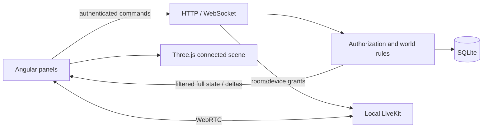

# Local architecture and operations

## Data and trust boundaries

The scene never awards currency or writes account state. The server admits room entry, walks routes, applies capacity/access/age rules, records routines and grants economy rewards. A full state snapshot initializes every new socket; negotiated deltas compare consecutive *recipient-filtered* snapshots. Reconnect gets a fresh full snapshot. Clients with excessive outbound buffering are disconnected rather than accumulating unlimited memory.

| Module | Responsibility |
|---|---|
| `engine.mjs` | Schema/core world/economy, base commands and snapshots |
| `connected.mjs` | Pathfinding, object interaction and connected scene state |
| `social.mjs` | Homes/templates, delegated administration and media eligibility |
| `builder.mjs` | Geometry migration, admission spawn positions, validated atomic layout publish |
| `community.mjs` | Chat/DMs, audiences/history summaries, ownership offers, listings/reports and lifecycle |
| `devices.mjs` | Authoritative active device and 30-second reservations |
| `accounts.mjs` | Local contact challenges, passwords, sessions, reauthentication/reset/export/delete |
| `media.mjs` | Optional SFU grants and actual participant permission reconciliation |
| `index.mjs` | Loopback HTTP/static hosting and ordered WebSocket delivery |

Current prototype extension modules wrap core World methods in a defined order. Keep that order stable and run the domain/API suite when extracting these into independent services. SQLite is a single-process local choice; horizontal server scaling and durable shared presence are not implemented.

## Configuration

`npm run dev:media` explicitly loads `.env.example`. Ordinary `npm run dev` does not. Public example credentials are for localhost only. Native LiveKit binds to 127.0.0.1 and enables loopback ICE candidates. The Docker configuration binds inside its container; Compose publishes only localhost ports. Hosted/TURN/TLS setup is separate.

`TIMROM_OPERATORS` lists trusted, already-created usernames. Use process/local ignored environment configuration; do not add real administrator information or secrets to the repository. Empty means no platform operator. Home moderators cannot approve public listings or resolve platform reports by default.

Never run multiple app server instances against one database as if they shared live presence: the current presence/device/reservation maps are process-local. The integrated production preview serves the app and API from the same selected `PORT`.

## Persistence and lifecycle

Accounts use hashed passwords and persisted sessions/challenges. Reauthentication tickets are session-bound and expire after five minutes. Adding a missing contact requires reauthentication plus verification through the labelled local challenge. Changing an existing contact and real provider delivery are outstanding work.

Donation/loan offers are pending until accepted by the receiving home's owner/admin. Donations become home-owned; loans remain lender-owned. Home deletion returns loans and surviving donated items to existing original owners without coin refunds; starter/orphaned items retire. Owner transfer requires recipient acceptance. Account deletion first requires transferring or deleting owned homes.

Private room permission and block rules filter state before delivery. History summaries aggregate the requesting user's records over client-local day/week boundaries; edits/backfills do not enter reward windows. The visible history page remains bounded, while totals cover all overlapping records in the requested recent period.

## Media boundary

LiveKit grants are derived from current room membership, active device, voice eligibility, mute/video state and speaker role. The service compares actual participants with server-authoritative permissions and removes stale room/device identities. Camera admission is app-wide; unlimited forum entry is separate from media capacity. No audio recording/transcription is implemented.

**Known security limit:** previously issued self-hosted tokens are not immediately invalidated by participant removal. Reconciliation reduces stale access but permits a transient reconnect window. Resolve this explicitly before a public/teen pilot; do not equate the local adapter with a finished revocation design. See LiveKit's [token/grant documentation](https://docs.livekit.io/frontends/reference/tokens-grants/), [server API](https://docs.livekit.io/reference/server-sdk-js/classes/RoomServiceClient.html), and [configuration example](https://github.com/livekit/livekit/blob/master/config-sample.yaml).

## Verification and environment issue

`npm test` uses synthetic/in-memory data. `npm run test:load` creates an isolated server, connects 100 WebSocket clients and measures ten chat acknowledgements/received bytes. It intentionally does not claim media or rendering certification.

On 2 October this Mac stalled opening the parent Documents directory during esbuild resolution. A Node directory-listing probe reproduced that filesystem stall independently of Angular. Building an isolated copy under `/tmp` succeeded. Compiler/bundler diagnostics in `node_modules` were restored afterward; no patched dependency is part of this project. The final tested output was copied back to ignored `dist/`, and the preview started at :4200. Resolve the host filesystem issue before relying on normal development hot reload; the source project was not moved.
