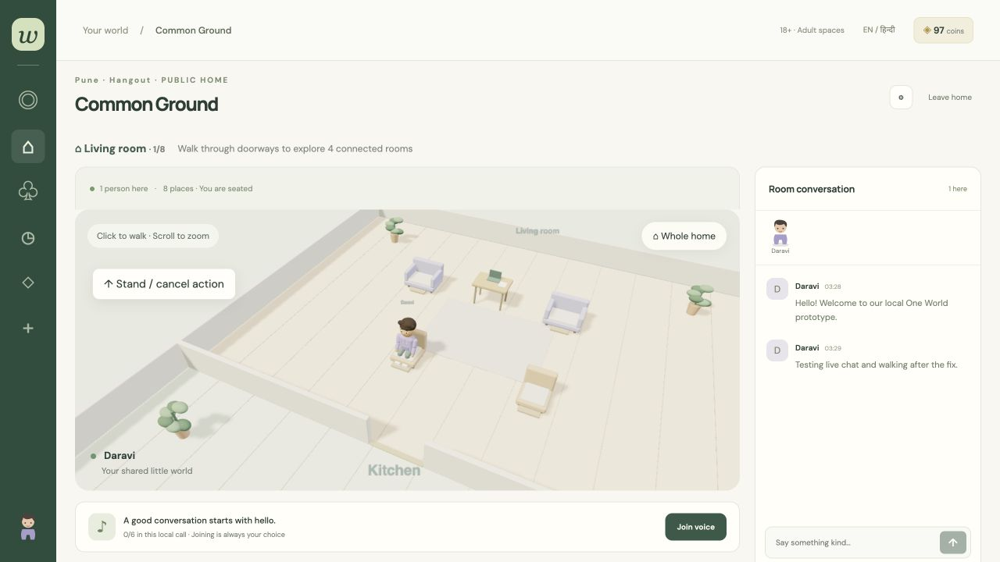

# One World — connected-house prototype v0.2

29 September 2026. Open [the local app](http://127.0.0.1:5173/). Existing local data was backed up before migration and preserved.

## What changed

The default in-home experience is now a continuous, soft sculpted 3D house with a following overhead camera. Click a floor in another room and the server routes the avatar through connected doorways. Crossing changes room chat and opted-in room activity. Capacity is checked again at the doorway; 0 means unlimited logical occupancy. Host locks block arrivals, and owners can manage locks from home cards.

Click furniture for an action menu. Chairs/sofas offer sitting, beds rest/sleep, desks study/work and counters eating. Approaching reserves one interaction slot. Furniture tracking is a separate, initially disabled setting; enabling it applies to future actions. It creates private timers and respects manual timers. Stopping/cancelling or reclaiming an item releases its slot. Room and furniture tracking use distinct activity sources.

Voice-follow is initially disabled and never starts a call. Once enabled and voice is joined explicitly, doorway crossings retain mic/camera state. A full destination call disconnects voice while still allowing room admission if occupancy permits. Six callers remains a local engineering limit, separate from room occupancy.

New accounts use unique @usernames, display names, email/password or mobile codes. A second contact can be linked later. Contacts appear only in the owner’s account panel. Passwords use salted scrypt hashes; new session tokens are hashed and expire. Codes are one-use, expire after five minutes and stop after five wrong attempts. **Codes are shown locally: email/SMS delivery is not connected and real contact ownership is not verified.** No payment or paid provider has been enabled.

## Motion and graphics status

The approved soft sculpted direction is represented with procedural articulated avatars, rounded furniture, soft shadows and cutaway walls. The controller interpolates authoritative waypoints, turns toward movement, blends pose changes and uses two-bone leg IK. Flat-ground stance/swing and world-distance scaling are tested for both avatar sizes.

This remains a prototype asset/controller implementation. Turning and start/stop foot contacts, hand-object contacts, believable desk/eating action clips, custom-sized seats/beds and avatar-to-avatar collisions still need refinement. Existing furniture is fixed in normal mode. No simulated throwable objects, ragdolls or full dynamics engine has been added.

The two-column floor plan, 12×9 tile rooms, one furniture-use slot per copy, walk speed, fixture prices and current asset dimensions are provisional engineering choices for this local build, not additional product approvals. Individual room-shape/door design and final art remain open.

## Verification and limits

- 30 automated tests pass, including authoritative doorway movement, last-slot admission, locked/full rooms, private furniture timers, manual precedence, call-follow/full-call handling, purchase/ownership rules, layout rollback, auth/code/linking/privacy and real HTTP/WebSocket integration.
- Browser checks cover test-account creation and returning sign-in, action menu, connected-room transition with chat/activity change, follow/overview camera and overlay panels. A 390px phone viewport showed no horizontal document overflow; chat stacks below the world on phones.
- Build succeeds; Three.js currently yields a bundle-size warning. Low-end phone performance and public concurrency have not been measured.
- Local WebRTC microphone/camera capture has not been exercised. Cross-network media needs SFU/TURN and real device testing.
- Teen/adult separation uses self-declared bands. Real age assurance, parental-consent requirements, moderation operations, public authentication hardening and provider integration remain launch work.
- Existing legacy demo identities remain usable via their existing tokens; they have no email/password upgrade/recovery flow yet. New signup creates a separate identity.
- The global globe, native mobile app, full Hindi coverage, DMs, embedded games, real coin purchases and advanced builder remain future stages.

Run instructions and source map: [application README](one-world/README.md).

## Captured views

[Phone-width capture](connected-home-mobile.png).
