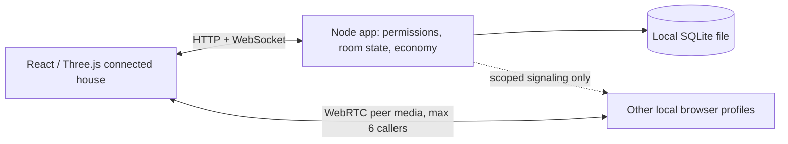

# One World — local application v0.2

A working local vertical slice of the proposed social world. Social interaction is the primary purpose; study, work and gaming are supported contexts. This app replaces the earlier simulation for implementation testing. It is not a public launch build.

## Run locally

Use **Node 24.15+** (native SQLite). Node 20 will fail with `ERR_UNKNOWN_BUILTIN_MODULE: node:sqlite`.

```sh
cd references/one-world
nvm use
npm ci
npm run dev
```

Open **http://127.0.0.1:5173/**. Vite serves the client on 5173 and proxies HTTP/WebSocket traffic to the application server on 3011. Both bind to the loopback interface. No paid services, API keys, containers or cloud account are required.

Run `node --version` to confirm Node 24.15 or newer is active before starting the app.

```sh
npm test
npm run build
npm start
```

`npm start` serves the built client and API together at http://127.0.0.1:3011/. Stop the dev server first if it is already using port 3011. A page opened at a different port has separate browser storage; sign in again there.

## Try the complete loop

1. Create an account using a fictional email + password or mobile number. Pick a unique @username and display name. This local build shows a **test code** instead of sending email/SMS. It does not verify real contact ownership or age. Use email/password or another local mobile code to return later.
2. Enter a home, then click a floor destination. The avatar walks through connected doorways; chat changes when the server admits you to the next room. Full/locked rooms block entry. Use **Whole home** to zoom out, **Follow me** to return, or scroll to zoom. Arrow keys work when the canvas is focused.
3. Click a chair, sofa, bed, desk or counter and choose its icon action. The avatar approaches before sitting, resting, sleeping, studying, working or eating. Use **Stand / cancel action** to stop. Usable objects have one reserved interaction slot in this prototype.
4. Open **Account & privacy** (gear or profile) to separately opt in to furniture-based tracking or voice-follow. Both start off. Manual activity timers take priority over automatic tracking. Without furniture consent, object interactions are visual only. Self-reported avatar actions cannot prove real-life behavior.
5. Join voice explicitly. Microphone permission is requested; you enter muted, with camera off. With voice-follow enabled, an existing call follows doorway transitions while preserving mic/camera state. A full six-person destination call disconnects you from voice without rejecting room entry. Actual microphone/video capture has not been end-to-end tested.
6. Open activities, inventory, friends or globe discovery from the icon rail. Inside a home these are overlay panels; the world stays mounted. Text chat remains beside the scene at desktop widths, below it on a narrow phone screen.
7. Create an invite-only home, add rooms, drag capacity to **0 = unlimited occupancy**, or set a positive limit. Room settings can lock new arrivals; your discovery card's gear manages every room lock from outside the home. This prevents locking yourself out of host controls.
8. Buy a furniture copy with trial coins, then place it from your furnishing tray. Doorways, approach tiles and escape routes are protected transactionally. Furniture stays fixed during ordinary use. Themes are reusable. Room geometry is currently a fixed 12×9 grid assembled in two columns; room-shape/door editing is future work.
9. Lend or donate personal furniture. Lending keeps ownership and supports reclaim/host return. Donation permanently transfers one copy after confirmation. Reclaim cancels an interaction and leaves its user on the free approach tile.
10. Add a same-age-band friend by exact @username or avatar. Block/report from profiles; owners may ban. Reports stay in the local database. Gaming rooms support external game links; embedded games remain future work.

Existing legacy demo profiles, homes, chat, inventory and balances are preserved. They retain their old local token; they do not automatically gain an email/password account. New account creation makes a new identity. Do not sign out of an old demo identity expecting email-based recovery.

## Implemented in v0.2

- Three.js continuous house renderer, soft sculpted miniature/mature avatars, floor picking, doorway paths, follow/overview camera, distance-driven leg motion and two-bone foot IK.
- Real authoritative room admission on each crossing, path revalidation, same-home walking instead of tab teleporting, single-slot furniture reservations, builder rollback on blocked routes.
- Explicit furniture action menus; separate persisted furniture-tracking and voice-follow consent; private automatic activity sources distinguish room vs furniture.
- Email/password and mobile-code account flows; unique usernames; private contact linking; scrypt password hashes; hashed expiring sessions; expiring one-use codes with attempt and request limits. **Delivery is a development stub.** Production-mode challenge creation fails when delivery is unconfigured.
- Existing persistent chat, homes, inventory, XP/coin ledger, donations/loans, reports/blocks, age-band and owner checks.
- React responsive shell and partial English/Hindi labels. The new account/action screens are currently English.

The motion implementation is a functional prototype, not a finished character asset pipeline. The mathematical tests establish flat-ground IK and straight-line stance cancellation at both avatar scales; they do not establish production quality for every turn or interaction. Further work includes contact-aware turns/stops, hand/prop alignment for desk/eating actions, individually sized furniture, broader animation clips, avatar-to-avatar collision avoidance, and performance/accessibility testing on real phones.

## Trial economy, not approved final pricing

| Rule | Local trial value |
|---|---|
| XP | 1 per connected minute, once per account across tabs |
| Level | 1 + floor(total XP / 10) |
| Welcome coins | 120, clearly marked trial currency |
| Reward interval | One 60-second window per connected account |
| Qualifying chat | A non-repeated message while an unblocked other person is in the same room |
| Qualifying shared presence | At least 30 seconds with another call participant, or matching Socializing/Studying/Working/Gaming activities in the same room |
| Coin award | 2 coins maximum per window, regardless of overlapping eligible sources |
| Rest/sleep/eating/private break | XP while connected; no coins for the passive activity alone; chat/call participation can still qualify |
| Message spam | 8 commands per 10 seconds, identical text rejected for 30 seconds, replay nonce deduplicated |

No daily XP cap, idle penalty or paid XP. No coins for merely being online. Users do not have to publish activities to qualify. The trial detects only simple spam; idle calls, colluding accounts and falsely declared activities can farm coins. Advanced anti-abuse, provenance for purchased coins, verified payments and economic balancing are future work. Pilot caps (200 personal inventory instances, 20 rooms/home, 6 callers, capacity input ≤10,000) are engineering limits, not an approved paid plan.

## Architecture and files



- `src/App.jsx`: product views, dialogs and interaction flows.
- `src/ConnectedScene.jsx`, `models.js`, `locomotion.mjs`: 3D house, articulated avatars and leg IK.
- `src/RoomScene.jsx`: remaining small SVG thumbnails and profile icons.
- `src/AccountScreen.jsx`: account creation, local-code verification, sign-in and linking.
- `src/useWorld.js`: local session, connection retry, command acknowledgments and snapshots.
- `src/useCall.js`: peer calls, negotiation and capture lifecycle.
- `server/engine.mjs`: persistence, permissions, activities and economy.
- `server/connected.mjs`: connected layout, paths, admission, furniture actions and consent.
- `server/accounts.mjs`: credentials, local challenge adapter, sessions and contact privacy.
- `server/index.mjs`: HTTP, WebSockets, signaling and server lifecycle.
- `tests/`: domain and real HTTP/WebSocket integration checks.
- `data/world.sqlite`: generated local data. Keep the data directory private; it contains private messages, contact details, password hashes and legacy plaintext demo tokens (new session tokens are hashed). Stop the app before taking a file-level backup of this directory, including SQLite sidecar files if present. No database is uploaded.

This single-process implementation serializes admission and purchases. Presence is in memory; durable records are in SQLite. It sends full per-user snapshots and is deliberately a small test system. It has no measured public concurrency guarantee. Room capacity 0 is a logical no-limit setting, not unlimited infrastructure.

The research document's PostgreSQL + SFU architecture remains the public-service direction. Migrate the persistence layer, add durable event IDs/resume, define deployment limits and load-test before scaling. No attempt has been made to copy Discord's scale or internal implementation.

## Verification

**30 automated tests pass**, including real HTTP/WebSocket integration, password/OTP flows, code expiration/replay/attempt limits, contact privacy/linking, connected-door movement, last-slot races, 0 capacity, locked routes, furniture consent/manual precedence, call-follow/full-call behavior, builder rollback, foot IK and straight-line stance at both scales. Existing economy, permissions, ownership, persistence, chat/spam and signaling tests continue to pass.

`npm run build` succeeds. The bundle includes Three.js and produces a size warning; production asset splitting and low-end-device profiling remain open. This is not a load/performance certification.

The v0.2 browser walkthrough verified fictional email registration using the clearly labelled local code, returning email/password sign-in, a connected-room crossing that changes chat and room-based activity, furniture menus, camera controls and overlay panels. The 390px mobile layout has no horizontal document overflow. See `../connected-home-preview.png` and `../connected-home-mobile.png`. No real SMS or email was sent. Live microphone/camera capture and conversations remain unverified.

## Next build priorities

1. Review the connected house and movement in the running app. Refine motion contacts, prop animations and furniture scale against the approved visual direction before calling the character assets final.
2. Connect actual email/SMS delivery, password reset, account upgrade/recovery, secure browser-session transport and independently reviewed age/parental-consent flows before any public pilot. Age bands are self-declared; the development verification stub does not satisfy verified-contact or child-safety launch requirements.
3. Add managed SFU + TURN, measure usage cost and test real media on multiple devices/networks. Local WebRTC has no external STUN/TURN and remains capped at six callers.
4. Finish bilingual copy, real geographic globe/search, friend presence/DMs, richer avatar customization, accessible object navigation and room/door editing.
5. Implement real-money coin payments only after prices, refunds, teen purchasing, payment-provider eligibility and moderation/operations are settled. No real payments or public deployment are enabled.
