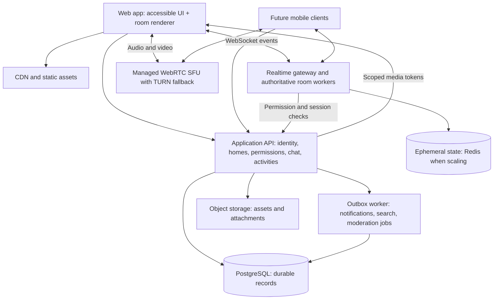

# One World — research and architecture options v0.8

Implementation update (29 September 2026): the local application now uses React + Three.js for a continuous house, a Node authoritative doorway graph and SQLite credentials/activity/ownership records. Media remains a six-peer local WebRTC mesh; verification delivery is a local test adapter. This preserves the low-cost iteration path below and does not replace the proposed public-service authentication, PostgreSQL, SFU/TURN, safety or operational requirements.

Research date: 29 September 2026. Published architecture articles describe the system at their publication dates; they are not a complete view of Discord's current private infrastructure. Our proposed architecture is a separate design judgment.

## 1. What Discord publicly documents

| Area | Published evidence | Useful lesson for this product |
|---|---|---|
| Live events | Discord's Elixir article describes WebSocket sessions, guild processes and event fanout; large guilds required distributing fanout work. [Source](https://discord.com/blog/how-discord-scaled-elixir-to-5-000-000-concurrent-users) | Route events to relevant homes/rooms, bound queues and avoid sending every world update to everyone |
| Durable messages | Discord describes its Cassandra-to-ScyllaDB migration, Rust data services and request coalescing. [Source](https://discord.com/blog/how-discord-stores-trillions-of-messages) | Start with an indexed transactional store; adopt specialized storage when measured workloads require it |
| Voice/video | A historical architecture article separates gateway, guild coordination and voice signaling/media forwarding; its custom C++ SFU forwards streams. [Source](https://discord.com/blog/how-discord-handles-two-and-half-million-concurrent-voice-users-using-webrtc) | Keep media traffic separate from ordinary chat and application APIs |
| Connection recovery | Current public Gateway documentation describes heartbeats, sequence numbers, reconnection and resume. It is primarily an integration API contract. [Source](https://docs.discord.com/developers/events/gateway) | Design reconnection and resynchronization as normal behavior |
| Access control | Discord documents role permissions and channel overrides. [Source](https://docs.discord.com/developers/topics/permissions) | Homes and rooms need explicit server-enforced permissions |
| Media privacy | Discord's 2026 announcement says voice/video calls now use E2EE, building on DAVE. [Source](https://discord.com/blog/every-voice-and-video-call-on-discord-is-now-end-to-end-encrypted) | Older transport diagrams are incomplete for today's media privacy; make encryption a deliberate product decision |

No evidence here establishes a complete current list of Discord's programming languages, databases, deployment systems or frontend frameworks. This proposal does not require copying Discord's private implementation or using Discord as our backend.

## 2. Adjacent product evidence

- **Gather Classic:** documented spatial audio/video and private areas show that proximity and bounded conversations are established patterns. The cited page explicitly concerns Classic 1.0, not a claim about every current Gather interface. [Gather documentation](https://support.gather.town/articles/4624155403-overview-of-spatial-audio-video)
- **WorkAdventure:** its documentation distinguishes proximity chat and direct/private conversations; some proximity history is transient. This makes history scope a product decision worth specifying. [WorkAdventure documentation](https://docs.workadventu.re/user/chat/)
- **Inference for our product:** differentiation must come from persistent community belonging, a distinctive room/character experience, and useful consensual activity tracking. “Avatars plus video chat” alone is already established. Desk research does not prove demand for the combined concept.

## 3. Proposed deployment shape

Founder constraints: India first; English/Hindi; 13+ with separate teen/adult spaces; all genres desired; solo experienced vibe coder; minimum budget; mostly real-life activities; connected homes approved. Start with a small number of deployables. Keep business modules together until scale or team ownership justifies separation. Use one application region near the first community and managed media locations appropriate to participants. Global discovery does not require global database writes on day one.

This is a logical diagram: not every box needs a separate microservice. Deploy the API and workers on infrastructure supporting their workloads; persistent WebSocket room workers should not depend on short-lived request functions.

### Candidate choices, pending team and benchmark

| Layer | Candidate | Reason / qualification |
|---|---|---|
| Web UI | React + TypeScript, optionally Next.js for routes/auth pages | Conventional app shell; graphics kept outside routine UI rerenders |
| Spatial renderer | PixiJS for 2D/2.5D; Three.js for rigged 3D | Choose from actual art/animation and device tests, not fashion |
| Room state | Colyseus or a small purpose-built authoritative WebSocket service | Colyseus documents server-controlled synchronized state; compare operational overhead |
| Application API | TypeScript modular backend | Shared contracts with web; language can change with team expertise |
| Durable data | PostgreSQL | Membership, messages, activities and permissions need clear consistency |
| Ephemeral data | In-process room state initially; Redis when horizontal scaling is needed | Single-owner state with expiry; never the sole message/history store |
| Calls | Managed LiveKit candidate | Web/mobile SDKs and room/media controls; validate SDK/browser support and actual cost |
| Attachments/assets | Object storage + CDN | Separate upload validation/scanning from message delivery |
| Search | Database search first | Dedicated index later when corpus and relevance require it |
| Mobile | React Native or native clients later | Share types and business rules; do not assume browser renderer ports unchanged |

References: [PixiJS](https://pixijs.com/8.x/tutorials), [Three.js animation](https://threejs.org/manual/pages/animation-system.html), [Colyseus state](https://docs.colyseus.io/state), [LiveKit transport](https://docs.livekit.io/transport/). SDK capabilities are not evidence that our application already implements them.

## 4. Important domain boundaries

**Durable entities:** User, Profile, AvatarConfiguration, Friendship, Block, Home, HomeMembership, Role, PermissionOverride, Room, LayoutVersion, Seat, Conversation, Message, Attachment, ActivitySession, ActivityVisibility, Region, HomeRegion, Invite, Report, ModerationAction and OutboxEvent.

**Ephemeral entities:** ConnectionSession, PresenceLease, RoomOccupancyLease, SeatLease, Position, Facing, AnimationState, TypingState and MediaConnectionState.

Room is a spatial/access concept; Conversation is a text audience; MediaSession is a live communication audience. They can align one-to-one initially but should not be collapsed into one record. “Study room with ongoing text history and optional voice” needs all three.

An ActivitySession should contain user, category, source, start/end instants, time-zone context, visibility, revision and optional room reference. A roleplay entry must remain distinguishable from a real-life journal entry. Store minimum metadata and avoid logging private activity content in routine analytics.

## 5. Request and event flows

### Join a room

1. Authenticate and check home/room permissions, bans and join policy.
2. Reserve occupancy atomically through the room's single authoritative owner. Count reservations while pending; expire abandoned ones.
3. Return a short-lived, single-use admission token linked to user, room, session and permission revision.
4. Recheck on connect; send a room snapshot plus event sequence and layout version.
5. Ask for voice join separately. Only then issue room-scoped media permissions.
6. Reconnect uses a short lease; expired lease requires a fresh admission check. When the room owner fails, a replacement uses a fencing epoch so two workers cannot both admit users.

Seat acquisition also has one authoritative winner. Room transfer needs reserve-new → leave-old → activate-new with timeouts/compensation, keeping one active spatial session. Decide whether to queue or offer another room when full; proposed beta simply offers another room.

### Move an avatar

Client sends destination intent with sequence number. Server validates reachable space, speed, boundaries and current permissions, then computes or validates the path. Broadcast compact state/path updates only within the relevant room. Client interpolates motion; server corrects invalid predictions. Do not persist every animation frame. A starter 10 Hz update rate is a benchmark input, not a guarantee; destination/path events may reduce traffic substantially.

### Send a message

Client sends conversation ID and idempotency key. Server checks access/rate limits and inserts the message plus an outbox event transactionally. ACK after durable commit. Worker delivers events; clients deduplicate by message/event ID and resume from a cursor. A sequence gap triggers replay or a new snapshot. Search and notifications are asynchronous; deletion must propagate to them as well.

Redis pub/sub alone is not durable delivery. A successful local animation of a message is not proof of successful storage; show pending/failed states and allow retry.

### Join or leave voice/video

API authorizes room access and signs a short-lived media token. Client connects to the media service; TURN relay handles networks where direct connectivity is unavailable. Mic/camera publishing follows explicit user choice and room permissions. On kick/ban, actively disconnect/revoke permissions at the media service and invalidate application admission. Token expiry alone is insufficient for an already connected participant. Cloud versus self-hosted token revocation differs; verify the selected deployment's semantics. [LiveKit token grants](https://docs.livekit.io/frontends/reference/tokens-grants/)

For private tables, use separate media rooms or server-authorized subscriptions. Do not send forbidden streams and rely on client-side volume=0. Spatial audio needs a reviewed membership/subscription design and boundary hysteresis to avoid rapid switching.

### Record an activity

Start operation uses a transaction, idempotency key and constraint/lock to ensure at most one running primary activity. A new activity closes or explicitly replaces the previous one. End/edit requests use version checks. Public projections contain only authorized fields and must refresh after privacy changes. Journal remains separate from online presence, media sessions and avatar pose.

## 6. Privacy and abuse engineering

Permission checks apply to API reads, messages, WebSocket subscriptions, search results, notifications, room rosters, media tokens and activity summaries. UI hiding is not authorization. Revalidate after membership/role changes and revoke live access. Use per-user blocking plus home moderation with auditable actions; do not give home owners blanket access to private activity journals.

Propose no recordings in beta. If E2EE is selected, implement key distribution, rotation, member removal and recovery deliberately; TLS/SRTP transport protection is not an E2EE claim. E2EE changes recording, transcription and moderation options. User-submitted reports can still support moderation, but the service cannot claim to inspect encrypted content it cannot decrypt. [LiveKit encryption](https://docs.livekit.io/transport/encryption/start/), [DAVE protocol](https://daveprotocol.com/)

The founder selected 13+ with separate teen/adult spaces; detailed contact and age-assurance rules remain unresolved. Contact boundaries, discovery, moderation staffing, geography visibility and child routine-tracking legality require a specific India review before launch; see the requirements revision. An age floor of 13 does not remove India’s under-18 child-data considerations. This document is not legal guidance. Store no precise GPS for this proposed discovery experience.

Use signed upload URLs, size/type limits, quarantine/scanning for user uploads, throttled invitations and reporting, administrative audit logs, account recovery, backup/restore procedures and deletion workflows. Retention needs to cover primary records, indexes, notifications, caches and backup expiry. Avoid private message/activity bodies in tracing.

## 7. Geography and discovery

Use stable geographic IDs with optional hierarchy and alternate/local names; retain neutral display choices for disputed regions and let homes choose global affiliation. GeoNames offers downloadable geographic data under attribution terms; validate source/licensing and coverage before import. [GeoNames export](https://www.geonames.org/export/)

Proposed filters: home name, genre/subgenre, country/region/city affiliation, language, time zone, room availability, friends present when permitted, event time, public/private join policy and accessibility features. Index only discoverable homes. Never infer home visitor location from the home's tag. Rank suitable occupied or upcoming spaces without exposing hidden attendance.

## 8. Capacity, cost and reliability

Do not size the system using registered users alone. Measure concurrent connections, active rooms, messages/sec, fanout, audio/video participant-minutes, average received bitrate, attachments, asset downloads and moderation load.

Illustrative pilot: 100 daily users × 60 media minutes/day × 30 days = **180,000 participant-minutes/month**. Four people in a 30-minute call consume 120 participant-minutes. An aggregate 1 Mbps received continuously over 180,000 participant-minutes is approximately **1,350 GB decimal** before protocol overhead. Actual bandwidth changes with audio/video, subscribed tracks, resolution and adaptive quality. This is a workload calculation, not a price quote. LiveKit's own estimation guide distinguishes connection minutes and outbound bandwidth. [Pricing methodology](https://kb.livekit.io/articles/3947254704-understanding-livekit-cloud-pricing)

Monthly budget = app/worker hosting + database/backups + cache + asset storage/CDN + media participant usage/bandwidth + email/monitoring + moderation/support. Choose a provider plan only after budget and usage assumptions are agreed; verify live rates then. Sleeping/offline avatars should not keep a media session open merely to display a pose.

Proposed beta targets under a defined test region/device/network: p95 durable chat ACK under 500 ms; p95 room admission under 2 s; voice connection under 5 s when network allows; 30 fps minimum on agreed baseline devices; 99.5% monthly application availability. These are acceptance targets to negotiate and measure, not achieved benchmarks or worldwide promises. Define backup RPO/RTO once business requirements are known.

Track media join failure, packet loss, reconnect frequency, gateway backlog, room CPU, database latency, admission rejection, report handling latency and cost per active group. Use capped exponential reconnect backoff with jitter. Circuit-break overloaded dependencies; degrade to text when media fails.

Scale path: one application region and bounded rooms → multiple room workers with one owner per room → better search/event processing and regional routing → database partitioning/specialized stores only after profiling. A global map need not simulate the whole globe. Large rooms cost disproportionately because update and media fanout grow with participants.

## 9. Verification and delivery gates

1. **Product decisions:** target user, world model, tracking semantics, audio boundaries and visual direction.
2. **Exploratory prototype:** observe navigation, audience understanding, movement and journaling; no production claims.
3. **Technical vertical slice:** two real clients join a room, exchange persisted messages, move, contend for one seat, join/leave actual media, reconnect and revoke permissions.
4. **Closed beta readiness:** private-data leakage tests; invalid movement; simultaneous last-seat requests; duplicate messages; stale tokens; malicious uploads; multi-device activities; cross-midnight/time-zone changes; room worker crash; camera denial; browser backgrounding; keyboard and screen-reader use.
5. **Operational trial:** load test against the agreed concurrency, restoration drill, moderation workflow, device matrix, measured vendor bill and alerts.
6. **Public launch:** working community supply, staffed safety operations, clear policy/privacy behavior, deployment rollback and ownership.

Future mobile clients reuse API/event schemas and the data model. Validate push, background audio, deep links, permissions and renderer performance independently; a responsive web view alone is not a complete native-mobile strategy.

## 10. Cost alternatives to evaluate for the ₹2,000/month starting target

| Choice | Low-cash option | Tradeoff and decision trigger |
|---|---|---|
| Chat/API/data | One small VM with app and PostgreSQL, separate backups | Less vendor overhead but founder owns patching, recovery and availability; compare a managed database before choosing |
| State coordination | Single room-worker process; no external cache initially | Saves service cost; a crash loses ephemeral room state and requires resync |
| Calls | Managed SFU allowance for initial validation | Lowest operational burden; meter usage and set alerts before opening discovery |
| Calls alternative | Self-host LiveKit on a suitable VM | Open-source server is not free operation; bandwidth, TURN, monitoring, upgrades and DDoS response remain costs |
| Small calls alternative | Peer-to-peer mesh for tiny private groups | Signaling and TURN still required; growing upload/download and weak fit for larger rooms make it a poor default |
| Assets | One shared rig or constrained sprite catalog | Fewer combinations reduce art production and bandwidth |
| Search/globe | Local geographic dataset + database filters + lightweight globe | Attribute sources; avoid a paid geocoding request for every browse action |
| Localization | Human-reviewed English/Hindi strings | No automatic-translation API dependency for interface text |

Founder confirmed a ₹2,000/month starting target and invited necessary adjustments. No guaranteed free tier or monthly total is asserted. Before deployment, compare current official pricing with measured participant-minutes, bandwidth and storage, then add a contingency and explicit spending alerts. Essential reporting, privacy controls, backups and child safeguards are not optional cost cuts.

Confirmed access model: invite-only homes can be created by anyone; public discovery requires host review; one explicitly joined room-wide voice conversation per room. Automatic room-to-activity mapping follows user opt-in, with visible running state and pause/override.

### Official pricing snapshot — checked 29 September 2026

- [LiveKit pricing](https://livekit.com/pricing): Build $0/month includes 5,000 WebRTC participant-minutes, 100 concurrent connections and 50 GB downstream transfer. Ship starts at $50/month, includes 150,000 WebRTC minutes and 250 GB downstream transfer, then lists $0.0005/minute and $0.12/GB. These are transport figures, not AI-agent minutes. Recheck quotas, hard limits and billing behavior before enabling a plan.
- [DigitalOcean basic VM pricing](https://www.digitalocean.com/pricing/droplets): regular 1 GiB/1 vCPU lists $6/month; 2 GiB/1 vCPU $12/month. These are infrastructure examples, not a proven capacity estimate for our workload. Region, backups, taxes and transfer conditions matter.
- [Supabase pricing](https://supabase.com/pricing): Free lists a 500 MB database and pauses projects after a week of inactivity; Pro starts at $25/month. A large monthly-active-user allowance is not a guarantee of room-state or media capacity.
- [Cloudflare Pages limits](https://developers.cloudflare.com/pages/platform/limits/) should be checked for the static prototype/app asset deployment; Pages is not the long-lived room server.

A small test scenario is 10 people × 30 media minutes × 16 days = 4,800 participant-minutes. At 1 Mbps aggregate received bitrate throughout, that corresponds to approximately 36 GB decimal before overhead. Extra calls, larger video subscriptions or retries can exceed these assumptions. Maintain a reserve and enforce application-level limits before quota exhaustion.

Recommendation: use free managed media only for this bounded validation, and use the ₹2,000 target for modest app hosting/backups and contingency. Compare actual invoices before adding public traffic. Do not enroll in paid plans or self-host media solely because software is open source. The $50 managed-media tier alone requires revisiting the INR budget; no exchange-rate conversion is assumed here.

## 11. Architecture additions from founder clarification

### Admission and unlimited occupancy

Room.capacity is an integer >= 0, with 0 as the explicit unlimited sentinel. Validate at API/database boundaries; never use a generic truthiness check to infer an absent setting. The room owner serializes admission: verify membership/ban/age policy → deduplicate existing admission → reject if capacity > 0 and occupied + reserved >= capacity → reserve slot → connect. Permission validation still applies when capacity is 0. Host/moderator accounts also consume slots. Room-setting updates are authorized, revision-checked and audited.

Seat leases remain finite and independent. Reconnects reuse the same valid occupancy lease; expiry releases it. Lowering capacity below present occupancy retains current users and prevents new admission. A failed join must not leave the old room or stop its media/activity session. On crashes, fencing epochs prevent two owners both granting the final slot.

Verify: capacity 1 with host inside; last-slot race across workers; 0 with nonzero occupancy; 0→positive→0; lowering below occupancy; concurrent pending reservation; duplicate join; invalid input; kick/ban in unlimited room; room full while a user is walking toward the door; same-session reconnect at capacity. “Unlimited” is a product setting, not a successful capacity benchmark. Large-room avatar interest management and explicit media quotas are required before removing pilot operational bounds.

### Builder and avatar assets

Add AssetCatalogItem, AssetEntitlement, LayoutDraft, LayoutVersion, PlacedObject and AvatarBodyVariant. Each placed object has an asset/version, position, orientation, footprint and interaction anchors. Shared rendering/physics data must align for miniature and mature avatars; collision/access checks must not be bypassed by choosing a smaller cosmetic avatar. Validate entitlements and layout reachability server-side before publishing. Keep drafts separate from the currently live layout, with revision checks and undo/redo history as appropriate.

### XP and currency ledgers

Founder chose all logged-in time, including idle/background/rest, to earn XP. Working interpretation is authenticated connected time, not persisted auth-cookie lifetime. Merge overlapping connection intervals per account; no multiplying awards across tabs/devices. Server time and bounded reconnect leases govern elapsed time; heartbeat/lease renewal is connection evidence, not proof of real-life activity. Specify suspended-browser/network-grace behavior explicitly. Do not silently impose activity-only eligibility, daily caps or sleep exclusions.

Add AccountProgression, ConnectedInterval, RewardPolicyVersion, XPGrant, CurrencyTransaction, CatalogLevelRequirement and ItemOwnership. Cumulative XP determines a level and grants catalog eligibility; coins earned through qualifying voice chat, text chat and activities, or purchased with real money, fund purchases. Presence alone must never create a coin grant. XP is never debited for purchases. Credit XP once per online-time interval and coins once per qualifying source event/window, each with its own unique grant ID and versioned policy. These are separate grant pipelines. Corrections are explicit reversal/adjustment entries; never trust client-submitted elapsed time or balance. Rates, thresholds and prices remain undecided.

A purchase transaction verifies user, level eligibility, asset version, ownership and sufficient currency, then atomically debits currency and inserts ownership using an idempotency key. Competing purchases cannot overspend; repeated requests cannot double-charge. Confirmed inventory: furniture purchases add one physical instance per purchased unit; themes/colors/textures grant one reusable entitlement. A furniture instance has at most one active placement, enforced transactionally across homes. Storing or moving it preserves ownership; a reusable finish needs no per-placement debit. Furniture is owned by its purchaser unless explicitly donated to a home. Store owner_type (user/home), owner_id and placement independently; only the current owner may initiate donation, and placement alone never transfers ownership. Entitlement checks apply again when saving a layout.

Keep time-based reward accounting independent from private activity contents. Privacy changes do not revoke earned XP; no public sharing requirement. Minimize retained connection detail while retaining sufficient ledger integrity under the agreed deletion/retention policy. The teen-data review remains applicable to connected-time rewards.

The first release only coordinates external-game social activity. It does not execute arbitrary user mini-games or detect desktop processes. Embedded mini-games remain a later sandboxing and resource-isolation design.

## 12. Paid coins: planned payment boundary

Add CoinPackVersion, PaymentOrder, PaymentAttempt, ProviderEvent, CoinCreditLot, Refund, Dispute, InventoryInstance and ReusableEntitlement. Store INR in integer paise and coins in integer units; do not use floating point. Keep earned and purchased coin provenance even if the UI shows one spendable balance. Purchased coins never mint XP or bypass a catalog level requirement.

Web purchase flow: client selects a pack ID → backend snapshots pack version/INR amount/coin quantity and creates a provider order → provider-hosted checkout → server verifies the provider result and captured/paid status → durable transaction records payment and coin credit exactly once → client observes confirmed balance. Never credit solely from a browser success callback. Bind payment to account, internal order, currency and expected amount; an authorized-but-uncaptured payment is not enough to fulfill.

Razorpay is a candidate, not a selected or integrated vendor. Its official documentation describes server-created orders and payment verification, and recommends server-side webhooks for confirmation. Validate webhook signatures using the raw request body, deduplicate events and tolerate retries/out-of-order delivery. Both callback verification and webhook processing must converge on one unique payment-credit record. [Web integration](https://razorpay.com/docs/payments/payment-gateway/web-integration/standard/integration-steps/), [webhook validation](https://razorpay.com/docs/webhooks/validate-test/).

Track payment lifecycle separately from coin delivery: created, pending, confirmed, credit-pending, credited, failed/cancelled, refunded/partially-refunded and disputed. Reconcile paid orders that did not receive credit. Add append-only correction/reversal entries rather than rewriting balances. Refunds/disputes need a policy for already-spent purchased coins and placed items; preserve the linkage for support and do not silently seize unrelated earned balances. No refund rules are approved yet.

Before payment release, verify provider onboarding and business eligibility, fees, receipts/tax treatment, refund/support processes and teen purchasing controls. This is a requirements checklist, not a legal classification of the coin system. Future native apps require a separate current app-store billing assessment; do not assume the web checkout can simply be embedded in every mobile distribution.

Acceptance tests: duplicate webhooks; valid signature but wrong amount/account/order; browser success with no captured payment; delayed captured event; lost callback; process crash after payment before coin credit; concurrent item purchases; negative/overflow quantities; replayed checkout; partial/full refund; dispute after spending; no XP change on top-up; below-level user with many coins cannot purchase a locked item; one furniture instance cannot be placed twice; owned finishes are reusable without further charge.

## 13. Participation rewards, donation and lending

Introduce CoinRewardPolicy and CoinRewardGrant alongside the existing XPGrant. A coin grant records source kind (text, voice, activity), unique source event/window, policy version, beneficiary and amount. Decide whether cross-source overlaps stack before choosing the deduplication key. All-time online XP remains independent; an online heartbeat is not a qualifying coin event. Changes to activity history or replayed message/media events must not mint repeated grants. Chat rewards use founder-approved participation time windows with spam checks. Window length, qualification details, numerical rates and overlap rules remain unresolved; store policy versions to explain each grant.

Text signals can derive from durable authorized messages; voice signals from verified membership/session metadata; activity signals from versioned activity sessions. Proposed minimal-data eligibility avoids requiring raw audio recording, transcripts or publishing private routine details. A connected mic is not proof of conversation; the chosen policy must explicitly address listening, silent sessions, multiple accounts, duplicate messages, self-chat and interrupted activity records. Private-space eligibility must not bypass existing permissions or disclose the content to hosts.

Donation is an atomic, idempotent ownership transfer, not a copy: authenticate donor → lock inventory instance → verify current ownership/target home policy → resolve active placement/occupied-seat conflicts → transfer owner to home → append DonationRecord and audit event → update inventory/layout views. Do not credit coins or XP for donation unless separately approved. Retry cannot mint another instance. Races among donate, move, place, purchase reversal and home deletion need a single consistent outcome.

Proposed member-leave handling returns personal furniture to the member's inventory and retains donated furniture in the home. Removing an occupied chair requires safely clearing/repositioning its occupant. Both permanent donation and temporary lending are founder-confirmed for launch. Recipient acceptance, recall/leave defaults and donated-asset handling on home deletion/succession remain to be finalized. Payment dispute/reversal logic must retain purchase provenance after donation without silently charging a different account.

## 14. Furniture loans: initial-release design

Add FurnitureLoan with inventory_instance_id, lender_user_id, borrower_home_id, status, requested/accepted/return timestamps, revision, initiator and audit references. Keep the inventory owner unchanged while a loan is active. Enforce at most one active loan and one active placement per instance. A home-owned donated copy has no active personal loan. A loaned copy cannot be donated or loaned onward by a borrower.

Proposed lifecycle: offered → active → return_requested → return_pending (only while resolving placement/occupant conflicts) → returned; offered may instead become declined/cancelled. Whether homes require acceptance is open. Lock/revision-check the same instance for placement, donation, loan, recall, payment correction and home deletion. Repeated requests must be idempotent; the borrower never gets a newly minted duplicate asset.

Recall is authorized by current ownership, not borrowing-home membership. Return by a host requires the relevant home inventory permission. Server blocks new interactions, coordinates occupied-seat relocation with the room owner, removes placement and marks the loan returned. Durable outbox events update all clients. If a room worker is unavailable, preserve a visible pending return and retry; failover must not leave the item simultaneously placeable in home and personal inventory.

Proposed leave/ban/deletion handlers terminate relevant personal loans. Donated items follow the separate home ownership policy. Ownership succession may change a home's managers but must not change the lender's ownership. Retain provenance through loan transitions for purchase dispute resolution; do not treat a loan return as an automatic cash refund or coin transaction.

Acceptance cases: donate-versus-lend race; two concurrent borrowers; repeat acceptance/recall; reclaim while lender is banned; home return; occupied-chair reclaim; disconnected room owner; home deletion; lender reconnect; no duplicate inventory after retry; borrower attempt to donate/re-lend; payment reversal during an active loan. Unit and integration tests belong with implementation; none are claimed as run for this specification-only update.

## Local implementation checkpoint — revision 0.7

The implemented vertical slice uses React/Vite, SVG floor rendering, one Node/WebSocket process and native SQLite. This minimizes local setup and has no hosted-service fee. It does not replace the public-service PostgreSQL/SFU architecture above. See [the application README](one-world/README.md) for runnable setup, boundaries and tests.

Admission, owner permissions, band separation, inventory and rewards are authoritative on the single server. SQLite transactions couple coin debit with inventory grants and deduplicate purchase IDs. Presence is in memory; restart drops live room occupancy while messages/activities/inventory persist. Reconnect receives a fresh snapshot, not replay of a durable event stream. Full snapshots and repeated SQL lookups are a small-pilot implementation choice, not a scalable fanout design.

Local media is a six-caller WebRTC mesh with scoped WebSocket signaling and no external STUN/TURN. It has capture and negotiation code but live audio/video and network compatibility still need testing. Public voice/video requires a validated SFU/TURN setup and metered usage budget. A ₹2,000/month target has not been demonstrated by a deployment or load test; running this version locally purchases no infrastructure.

Technical references used while implementing: [Node native SQLite](https://nodejs.org/api/sqlite.html), [Vite setup and runtime requirements](https://vite.dev/guide/), [MDN WebRTC perfect negotiation](https://developer.mozilla.org/en-US/docs/Web/API/WebRTC_API/Perfect_negotiation), [MDN RTCPeerConnection](https://developer.mozilla.org/en-US/docs/Web/API/RTCPeerConnection). The app is pinned by package-lock and requires Node 24.15+.

Latest reward requirement supersedes any ambiguous reference above to “activities”: all connected activity time earns XP; only interactive participation earns coins. The local eligibility signals/rates are trial settings, documented separately. Do not interpret a declared shared study session or idle call as fraud-resistant proof of interaction.

## Revision 0.8 — connected floor plan and identity changes

Confirmed requirements are recorded in [the new decision record](visual-review/decisions.md). The implementation plan must replace standalone room scenes/tabs with a persistent home scene, home-coordinate avatar state, a room/door connectivity graph, collision/path checks, door-level permissions and server admission on boundary crossing. Rendering continuity does not merge room permissions, capacity or voice membership. Camera follows at an angled overhead view with a whole-home zoom-out.

Voice auto-follow requires its own explicit opt-in and media membership transition: leave prior room, verify target room/call admission, join with existing device/mute choices. Preserve consent and prevent stale cross-room subscriptions. This does not authorize auto-unmuting or camera activation. Error and capacity handling remains to be reviewed before implementation.

Identity target: verified email+password or verified mobile OTP, either contact sufficient, optional later linking, unique username plus separate display name, private contact details. Real SMS/email providers, verification/recovery, collision-safe account linking, age assurance and migration from demo tokens are not yet implemented or silently selected.
